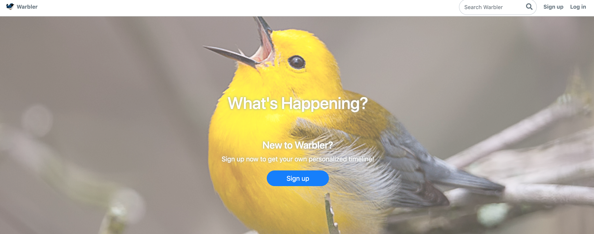
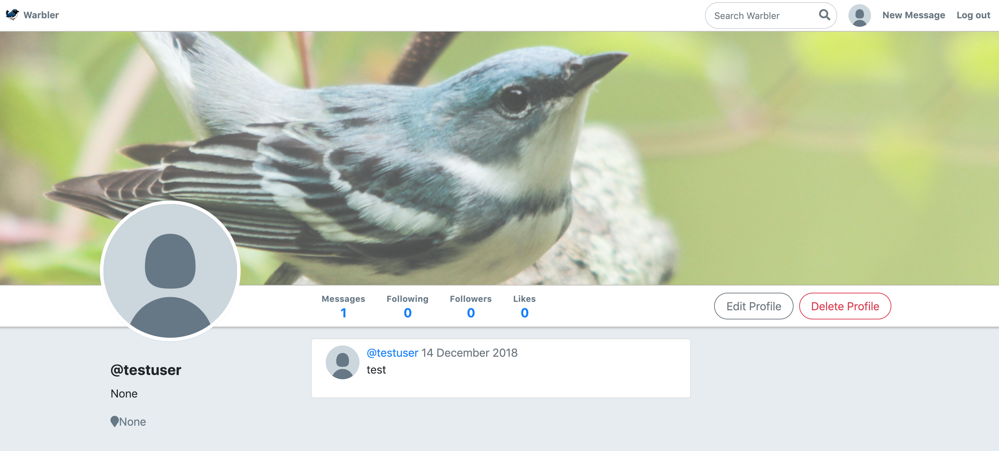

App deployed at : https://warblarblarg.herokuapp.com/

<a href="https://warblarblarg.herokuapp.com/"></a>

# Warblar - Twitter Clone 

> Warblar is a twitter clone with full CRUD on 'warbles' or tweets.  The site offers full features such as following/followers, sign up and authentication (encryption using bcrypt), warbles and more!

## Table of Contents (Optional)

- [Installation](#installation)
- [Features](#features)
- [Team](#team)

## Installation

```shell
python -m venv venv
source venv/bin/activate
pip install -r requirements.txt
flask run
```

### Clone

- Clone this repo to your local machine using `https://github.com/Lulzasaur/Rithm-Warbler`

---

## Features

- Full Flask application utilizing bcrypt for encryption.



---

## Team

| <a href="https://github.com/silasburger" target="_blank">**Silas Burger**</a> | 

| <a href="https://github.com/silasburger" target="_blank">`github.com/silasburger`</a> | 


